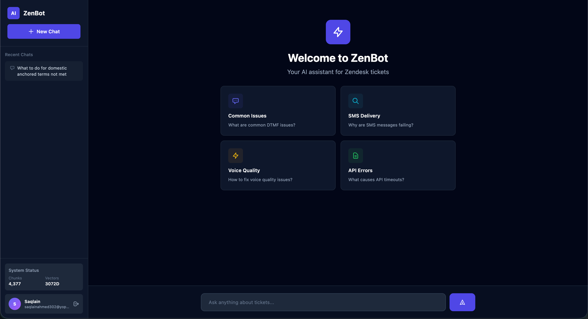

# 🤖 ZenBot - AI Zendesk Assistant

Simple, fast AI chatbot for instant answers from your Zendesk tickets.



## 🚀 Quick Start

```bash
# 1. Install Python dependencies
pip install -r requirements.txt

# 2. Configure API key in .env
# OPENAI_API_KEY=sk-proj-...

# 3. Start server
./start.sh
```

**Open http://localhost:8000**

---

## 📁 Structure

```
├── backend/        # FastAPI server
├── static/         # HTML/JS/CSS frontend
├── scripts/        # Data pipeline
├── data/           # JSON files
├── tests/          # Tests
└── start.sh        # Startup script
```

---

## 🎯 Features

- **Simple HTML UI** - No build process, works instantly
- **Tailwind CSS** - Modern, responsive design
- **FastAPI Backend** - Fast, auto-documented API
- **AI Search** - Semantic search through 4,377 tickets
- **Smart Answers** - GPT-4o powered responses
- **Citations** - Links to source tickets

---

## 🔧 Development

```bash
# Backend only
cd backend && python3 app.py

# Run pipeline
python3 scripts/pipeline.py --all

# API docs
http://localhost:8000/docs
```

---

## ⚙️ Requirements

- Python 3.9+
- OpenAI API key
- 4,377 indexed chunks (already done)

---

Built with FastAPI, Tailwind CSS, Qdrant, and OpenAI
